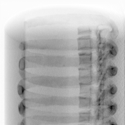
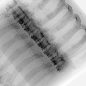
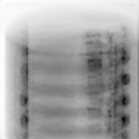
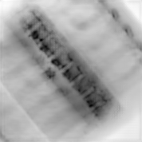
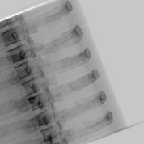
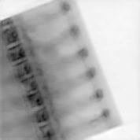
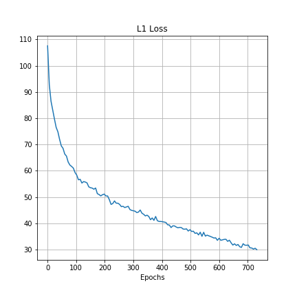
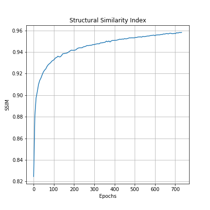

# Image To Image translation for chest X-ray images

Stereotactic Body Radiation Therapy ([SBRT](https://www.uclahealth.org/radonc/faqs-sbrt)) is a technique for treating cancerous tumors in the body by delivering a single high dose of radiation very precisely to the tumor location. Compared to the conventional methods, SBRT allows the tumor to be treated in a much shorter amount of time with much less radiation exposure for the healthy part of the body.

SBRT requires the tumor to be located with high precision. To this end, Dual Energy X-ray imaging is one of the conventional methods of improving the visualization of the tumor and the surrounding area. In this technique, the patient is imaged with two different X-ray frequencies and the images are combined to produce tissue-selective or bone-selective images.

However, the downside of Dual Energy X-ray imaging is that the patient is (usually) exposed to double the amount of radiation than a conventional Single Energy X-ray image. **The purpose of this project is to develop a model that learns to produce a Dual Energy X-ray image from one Single Energy X-ray image.**
## Dataset
The images used in the dataset were Digitally Reconstructed Radiographs (DRRs) created from a 3D CT scan image projected onto different planes. These are similar to X-ray images in most aspects; however, it does remain to be seen how well the model generalizes to actual X-ray images.

The dataset consisted of ~700 images of Single Energy X-rays and ~1400 Dual Energy X-rays. These were obtained from a single patient (which is another factor affecting the generalization capabilityo of the model).

| Single Energy X-ray  | Dual Energy X-ray (bone) | 
|---------------|---------------|
|||
|||

## Model Architecture
The model architecture is largely inspired from [pix2pix](https://arxiv.org/pdf/1611.07004.pdf) paper. It comprises of 2 parts - the generator model and the discriminator model. The idea is to train the generator to create realistic images and to train discriminator to differentiate between real images and generated images.

The generator model is a Convolutional Neural Network similar to [U-Net](https://arxiv.org/abs/1505.04597) which inputs a Single Energy (SE) X-ray image and (tries to) generate its Dual Energy (DE) counterpart. 

These two images (SE + fake DE) are paired and fed to the discriminator model. The discriminator model also recieves pairs of ground truth (SE + real DE) images. The discriminator tries to predict which pairs are real and which pairs are fake. The discriminator model design is inpired from [PatchGAN](https://arxiv.org/abs/1604.04382) architecture, where the output is not a single scalar (corresponding to real/fake images) but a 2D array of 1s or 0s. 

## Results
We trained multiple models to generate bone-selective DE images and tissue-selective separately as well as jointly. Following are some of the outputs of the trained models:

| Single Energy X-ray  | DE Bone (real) | DE Bone (generated) |
|----------------------|----------------|---------------------|
||||
||||
||||

It is difficult to measure the performace of a GAN based solely on the loss values because there are two competing models trying their best to affect the loss function in opposite directions. However, we can measure the L1 distance and the SSIM value between the target and the output images. Following graphs show these metrics during training:

| L1 distance  | Structural Similarity Index (SSIM) |
|--------------|------------------------------------|
|||

Both of these graphs show that the generator model is steadily learning to output more and more realistsic images. 